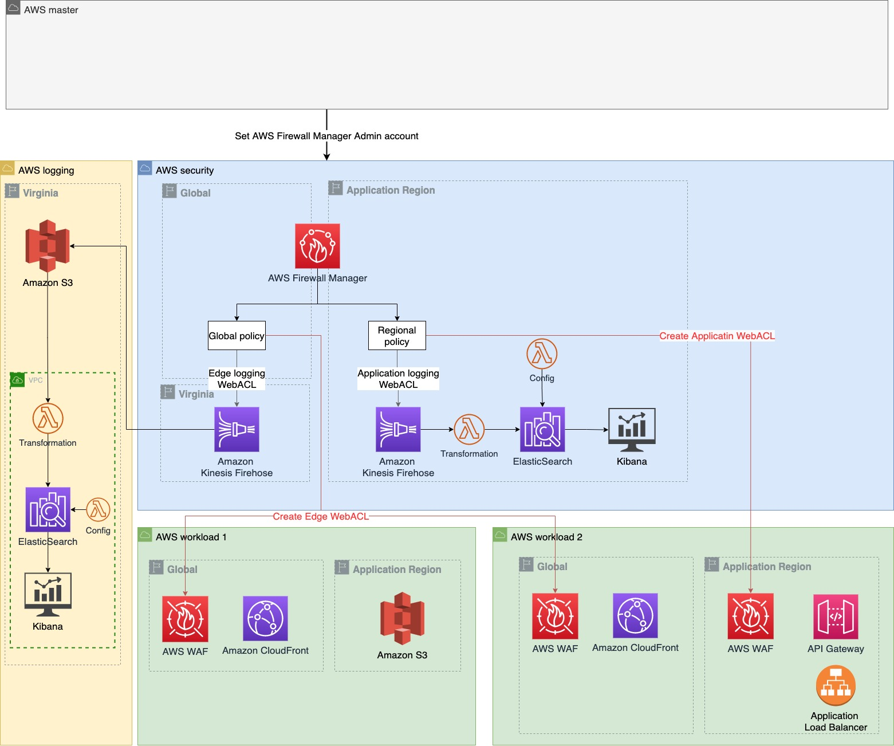
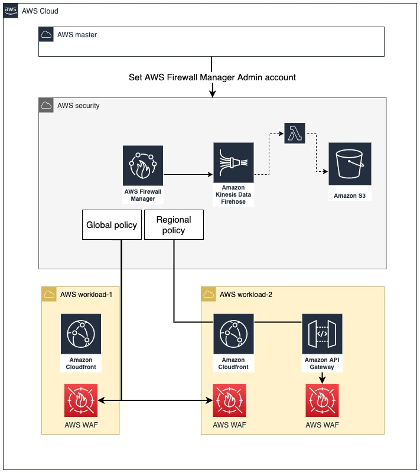
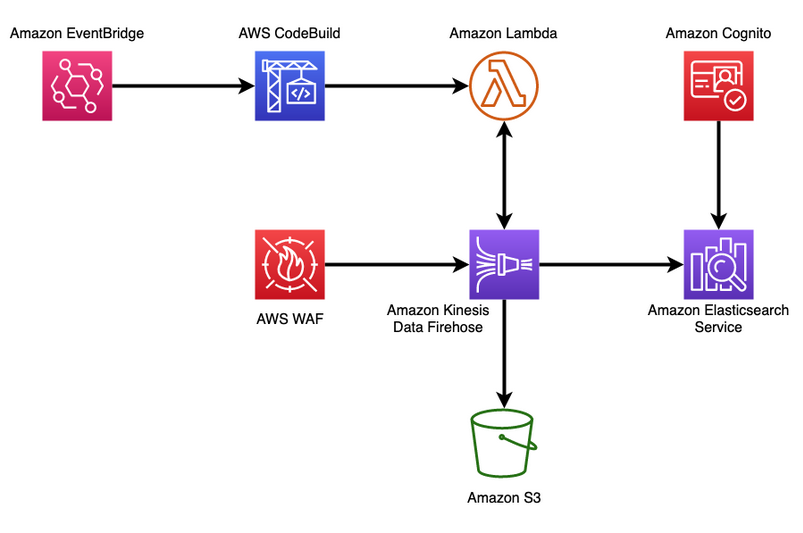
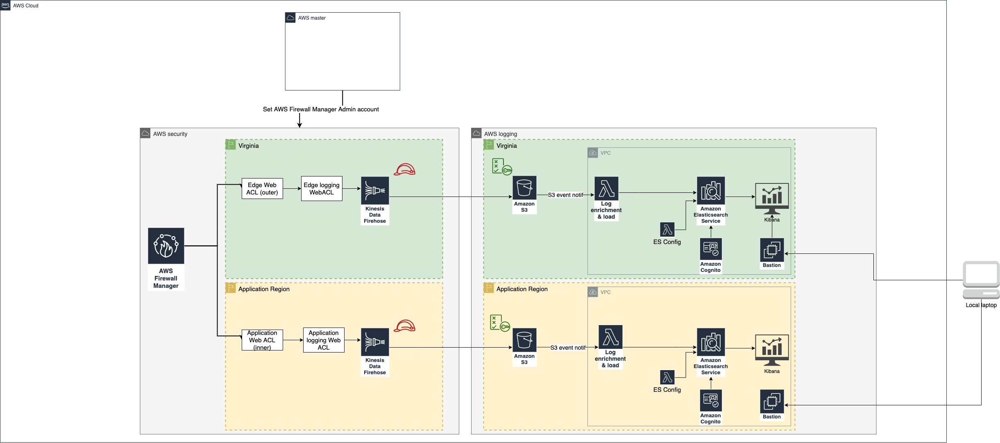

# AWS WAF Terraform artifacts
Check documentation under the folder /documentation.

## Introduction
The intention of this document is to provide a clear documentation about the artifacts created to deploy AWS WAF and its configuration using Terraform as IaC provider.

Available features:
>	AWS Firewall Manager WAF policy with account and resource scope

>	Centralized logging configuration for AWS WAF Web ACLs

>	Dashboard using Amazon ElasticSearch

>	Automation of AWS WAF IP set with CloudFront IP addresses and AWS WAF IP rule

>	Creation of AWS WAF custom rules (XSS, Regex, IP set, SQLi, Rate based)

>   AWS Managed Bot rules are used as an example

>   AWS WAF Rate based rule deployed with AWS Firewall Manager

>   3 types of logging configuration: 1) Kinesis -> S3, 2) Kinesis -> (cross account) S3 -> ES (private in VPC) and 3) Kinesis->lambda->ES->Kibana in the same account

### Architecture 

### Logging Option 1

### Logging Option 2

### Logging Option 3

### variables: 
The following variables are the most important ones, but please check the file **0-variables_firewall.tf** for a complete visibility. 

**For deployment**:
> master_region and application_region

> create_global_fms_waf_policy: enable or disable the creation of AWS Firewall Manager WAF policy with GLOBAL scope

> create_regional_fms_waf_policy: enable or disable the creation of AWS Firewall Manager WAF policy with REGIONAL scope

> create_waf_geo_rule_group: enable or disable the creation of AWS WAF rule group with Geolocation (it is not part of AWS Firewall Manager Policy by default)

> create_waf_regex_rule_group: enable or disable the creation of AWS WAF rule group with Regex pattern (it is not part of AWS Firewall Manager Policy by default)

> create_waf_geo_rule_group: enable or disable the creation of AWS WAF rule group with Geolocation (it is not part of AWS Firewall Manager Policy by default)

> create_waf_regex_rule_group: enable or disable the creation of AWS WAF rule group with Regex pattern (it is not part of AWS Firewall Manager Policy by default)

> create_waf_sqli_rule_group: enable or disable the creation of AWS WAF rule group with SQLi rule (it is not part of AWS Firewall Manager Policy by default)

> create_waf_xss_rule_group: enable or disable the creation of AWS WAF rule group with XSS rule (it is not part of AWS Firewall Manager Policy by default)

> create_waf_ip_rule_group: enable or disable the creation of AWS WAF rule group with IP set (it is not part of AWS Firewall Manager Policy by default)

> logging_option: variable that defines the logging resources to create. option1 by default. Available options: option1, option2 and option3.

**For Global Firewall Manager WAF policy**:
> global_policy_name: name for the AWS Firewall Manager WAF policy for CloudFront distributions

> global_policy_remediation_enabled (true by default)

> global_policy_orgunit_list: org unit of the workload accounts to deploy FM security policy for Shield Advanced

> global_policy_resource_tags: map of resource tags that aws firewall manager will check to associate web acl

> global_policy_overrideCustomerWebACLAssociation (true by default)

> global_policy_default_action (ALLOW by default)

**For regional Firewall Manager WAF policy**:
> regional_policy_name

> regional_policy_remediation_enabled

> regional_policy_orgunit_list

> regional_policy_resource_tags

> regional_policy_default_action

**For logging**:
> kinesis_firehose_name: name for kinesis firehose that is the aws waf logging destination (it has to starts with aws-waf-logs-)

> kinesis_destination_s3_name: name for s3 bucket that is the target of kinesis firehose

> kinesis_prefix (waf-logs by default)

> DataNodeEBSVolumeSize: Volume side for ES Data Nodes

> ESConfigBucket: Name for ES Config Bucket

> ESUserEmail

> ES_SSH_tunnel_instance_type, ES_SSH_tunnel_amid_id_regional, ES_SSH_tunnel_amid_id_global and ES_SSH_tunnel_key_name

> ES_SSH_tunnel_allowed_CIDR: list of CIDR to allow access to SSH tunnel

## Pre-requisites
> AWS Organizations

> Member accounts must have AWS config enabled in the region

> Set the AWS Firewall Manager Admin account in the master account of the organization

> Customize the variable values in the file PROD.tfvars

> Update providers with your account IDs and your role name (0-providers.tf)

## Deployment steps

1. Add your details in providers (role to assume), variables and vars/PROD.tfvars

2. Choose which AWS WAF Web Acls you are going to deploy. Use 1-fwm-global and 1-fmw-regional as a template for them. By default, both AWS Firewall manager policies will be deployed, but you can control this using create_global_fms_waf_policy and create_regional_fms_waf_policy vairables. The rule groups used in each policy are not customized with variables because of its format, so you can either deploy the rules that are established at the moment, or make the changes that your solution needs.

3. Choose which AWS WAF custom rules you are going to deploy. Use 3-aws-waf files as templates for them. Add those custom rules to rule groups and modify 1-fwm files. You can also control which AWS WAF custom rule group is created using the variables create_waf_*. Those custom rules groups are not part of the AWS Firewall Manager WAF policy by default. Also, the resources in 2-aws-waf-automation-ip.tf and 3-aws-waf-rate-based.tf will be created independently of the variables values. If you do not require those resources, please update the files.

4. Choose your logging configuration using the variable logging_option. Possible values: option1, option2 and option3. Options 2 and 3 use CloudFormation stacks for the deployment and configuration of Cognito and ElasticSearch.

6. Run first terraform plan and terraform apply. For logging configuration, there is a cycle between KMS key policy and Firehose IAM role. Create first one (IAM role) and then edit the other (KMS policy).

7.  {optional} If you would like to test these policies and you have other workload accounts, you can deploy CloudFront distribution + S3 bucket and CloudFront distribution + API GW using 5-optional and 6-optional files. Check the providers and the configuration values first.

### Solution

> Template for AWS Firewall Manager WAF policy to apply regional (for applications) and globally (for CloudFront). User needs to customize the rule groups that apply into the first and last rule group for AWS WAF.

> Templates for AWS WAF custom rules to create specific rules such as SQL injection, Cross-site scripting, Regex pattern, string matching, IP sets, Geo blocking, rate based rules, etc.

> Automation to create two IP sets with CloudFront IP addresses and a AWS WAF IP rule using those. Check blog https://aws.amazon.com/blogs/security/automatically-update-aws-waf-ip-sets-with-aws-ip-ranges/ but translated to terraform

> Logging configuration for 3 different cases: 1) Kinesis + S3 bucket in firewall manager account, 2) Kinesis in firewall manager account & S3 + ElasticSearch + Kibana in logging account,  and 3) Kinesis + ElasticSearch + Kibana in firewall manager account. In this script the solution 1 is implemented.

> Terraform does not support rule groups with rate based rules, workaround using CloudFormation template.

### Files

#### AWS Firewall Manager WAF policy
These are the files with the code to deploy a AWS WAF WebACL using AWS Firewall Manager:
-	**1-fwm-global-webacl.tf**: It creates an aws firewall manager policy in the global scope (provider calles global) for the resource type AWS::CloudFront::Distribution. With the input variables you can specify the values for the name, the remediation, Org unit, tags, default action, etc. For the AWS WAF WebACL, the following managed rules have been added: AWS managed rules Core Rule Set, AWS Managed admin protection, AWS Managed IP reputation, known bad inputs set and AWS Managed Bot Control rules (in count mode as an example of how to use it). A rate based rule has been added as a custom rule. For the logging, an Amazon Kinesis Firehose has been created in us-east-1.
- **1-fwm-regional-webacl.tf**: It created an aws firewall manager policy in a region (defined by the provider called regional) for the resource type Load Balancer and Api GW. With the input variables you can specify the values for the name, the remediation, Org unit, tags, default action, etc. For the AWS WAF WebACL, the following managed rules have been added: AWS Managed SQL injection rules, AWS Managed Linux rules, AWS Managed Unit rules, AWS Managed PHP rules and AWS Managed Word Press rules.IP allow set (CloudFront IP addresses) has been added as custom rule. For the logging, an Amazon Kinesis Firehose has been created in the region.

	
#### WAF Automation
File **“2-aws-waf-automation-ip.tf”** is using the automation from this AWS post, but the code has been translated into Terraform. This part created AWS IP set to collect CloudFront IP addresses (IPv4 and IPv6) and allow the traffic in the application from those IP addresses.

#### AWS WAF custom rules and Rule groups

Files:
- 	**3-aws-waf-geo.tf** : It shows how to define a Rule group to apply Geolocation block list. For the example, the country code used is “KP”.
- 	**3-aws-waf-ip.tf** : It shows how to define an IP Set and rule groups to Allow/Deny those IP sets.
- 	**3-aws-waf-regex.tf** : It shows how to define a regex pattern set and a rule group that uses it.* With the new release of Rate based rules supported by AWS Firewall Manager, this file may need to be updated.
- 	**3-aws-waf-rate-based.tf** and **3-aws-waf-rate-based.yaml** : Terraform does not support rule groups with rate based rules, workaround using CloudFormation template.
- 	**3-aws-waf-sqli-xss.tf** : It shows how to create a rule group that uses SQLi match statements.

#### Centralized logging

There are three options to deploy the centralized logging that you can use and customize.

1)	**Option 1**:  4-fwm-waf-logging-option1*.tf, Amazon Kinesis Firehose with S3 as destination in the same account and with KMS encryption. You can add a lambda to process the logs in Amazon Kinesis Firehose configuration.
2)	**Option 2**: 4-fwm-waf-logging-option2*.tf Kinesis Firehose -> (cross account) S3 -> ES (private in VPC). Check this artifact for more information about this architecture. This architecture uses a CloudFormation stack to deploy Amazon Kinesis Firehose, the IAM role used by Kinesis Firehose and the resources for Amazon Elastic Search. It also creates an ssh tunnel to access the dashboard, following this documentation.
3)	**Option 3**: 4-fwm-waf-logging-option3*.tf, Kinesis->lambda->ES->Kibana in the same account. This architecture uses a CloudFormation stack defined in the file dashboard.yaml.

#### Test resources
Files **5-optional-*.tf** create resources that can be protected by AWS WAF with the purpose of testing the AWS WAF WebACL.

## Example
Check the documentation in the folder documentation.